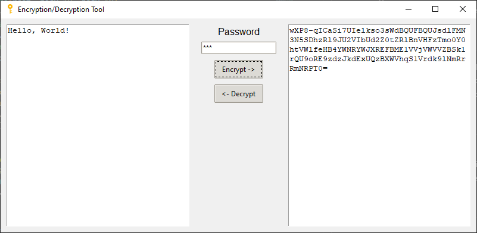

# Encryption/Decryption Tool

## Overview
This tool provides a simple and intuitive graphical user interface (GUI) for encrypting and decrypting text using a password. It is designed to be easy to use, much like Google Translate, but for converting plain text to encrypted text and vice versa. This can be particularly useful for sending sensitive information, like passwords, over chat applications where security is a concern.


## Features
- **Text Encryption**: Securely encrypt text with a password.
- **Text Decryption**: Decrypt encrypted text using the correct password.
- **User-Friendly Interface**: Clean and straightforward UI for effortless interaction.



## Prerequisites
- Python 3.x
- Tkinter (usually comes with Python)
- `cryptography` package
- `pyinstaller` package

## Installation

### Clone the Repository
```bash
git clone https://github.com/yourusername/encryption-decryption-tool.git
cd encryption-decryption-tool
```

### Set Up a Virtual Environment
```bash
python -m venv venv
# On Windows
venv\Scripts\activate
# On Unix or MacOS
source venv/bin/activate
```

### Install Required Packages
```bash
pip install -r requirements.txt
```

## Usage

### Start the Application
```bash
python app.py
```

### Encrypting Text
1. Enter the plain text into the left text box.
2. Type your chosen password into the password field.
3. ick the "Encrypt ->" button to get encrypted text in the right text box.

### Decrypting Text
1. Place the encrypted text into the right text box.
2. Enter the password used during encryption.
3. Click the "<- Decrypt" button to view the decrypted text in the left text box.


### Security Note
This tool is intended for educational use and should be applied with caution. The security level depends on the backend encryption algorithm.

### Contributing
If you're interested in contributing, please fork the repository and use a feature branch. Pull requests are warmly welcome.

### License
This project is licensed under the MIT License.


## Building the Executable with PyInstaller

### Prerequisite
Ensure PyInstaller is installed in your virtual environment. Installing all requirements as shown above should do the trick.

### Build the Executable
To create an executable for the first time, run the following command:

```bash
pyinstaller app.py --onefile --noconsole --name=endcrypt --icon=key.ico  --add-data "key.ico;."
```

Later you can just run the following command using the `spec` file created by `pyinstaller`

```bash
pyinstaller encrypt.spec
```

This will generate the executable in the dist directory.

### Running the Executable
Navigate to the dist folder and run the generated executable directly.